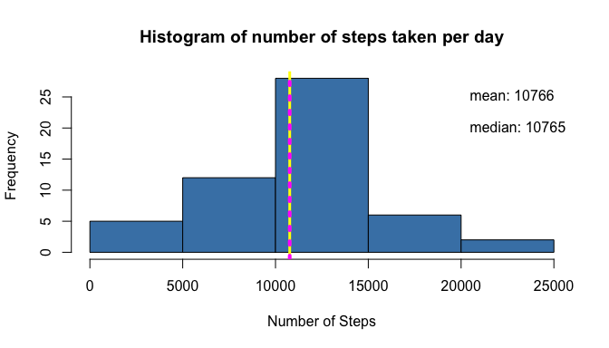
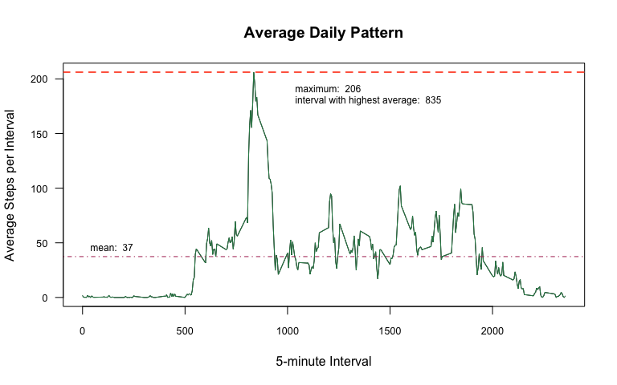
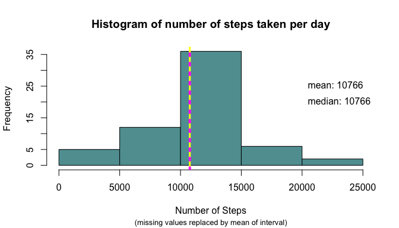
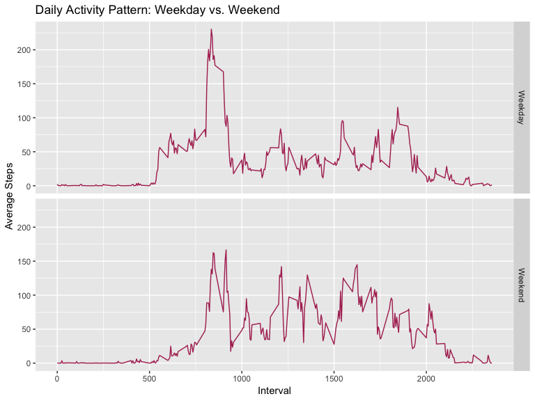

## Loading and preprocessing the data

Load R packages

```r
library(dplyr)
```

```
## Warning: package 'dplyr' was built under R version 3.5.1
```

```
## 
## Attaching package: 'dplyr'
```

```
## The following objects are masked from 'package:stats':
## 
##     filter, lag
```

```
## The following objects are masked from 'package:base':
## 
##     intersect, setdiff, setequal, union
```

```r
library(ggplot2)
```

Read data and summarize


```r
unzip("activity.zip")
activity <- read.csv("activity.csv", header = TRUE, stringsAsFactors = FALSE)
```


```r
str(activity)
```

```
## 'data.frame':	17568 obs. of  3 variables:
##  $ steps   : int  NA NA NA NA NA NA NA NA NA NA ...
##  $ date    : chr  "2012-10-01" "2012-10-01" "2012-10-01" "2012-10-01" ...
##  $ interval: int  0 5 10 15 20 25 30 35 40 45 ...
```

Change date variable from character to date class. Summarize data

```r
activity$date <- as.Date(activity$date, "%Y-%m-%d")
summary(activity)
```

```
##      steps             date               interval     
##  Min.   :  0.00   Min.   :2012-10-01   Min.   :   0.0  
##  1st Qu.:  0.00   1st Qu.:2012-10-16   1st Qu.: 588.8  
##  Median :  0.00   Median :2012-10-31   Median :1177.5  
##  Mean   : 37.38   Mean   :2012-10-31   Mean   :1177.5  
##  3rd Qu.: 12.00   3rd Qu.:2012-11-15   3rd Qu.:1766.2  
##  Max.   :806.00   Max.   :2012-11-30   Max.   :2355.0  
##  NA's   :2304
```

## What is mean total number of steps taken per day?

Calculate total number of steps taken per day

```r
bydate <- aggregate(steps ~ date, data = activity, FUN = "sum")
summary(bydate)
```

```
##       date                steps      
##  Min.   :2012-10-02   Min.   :   41  
##  1st Qu.:2012-10-16   1st Qu.: 8841  
##  Median :2012-10-29   Median :10765  
##  Mean   :2012-10-30   Mean   :10766  
##  3rd Qu.:2012-11-16   3rd Qu.:13294  
##  Max.   :2012-11-29   Max.   :21194
```
Summary of data indicates the average number of steps per day is 10766 (almost the same as the median: 10766). The maximum is 21194.

Plot histogram of steps taken per day, includes mean and median values


```r
hist(bydate$steps, col = "steelblue", main = "Histogram of number of steps taken per day", xlab = "Number of Steps")
abline(v=mean(bydate$steps), col = "yellow", lwd = 3, lty = 1)
abline(v=median(bydate$steps), col = "magenta", lwd=4, lty = 3)
text(20000, 25, paste("mean:", sep = " ", as.integer(mean(bydate$steps))), pos = 4)
text(20000, 20, paste("median:", sep = " ", as.integer(median(bydate$steps))), pos = 4)
```

<!-- -->


## What is the average daily activity pattern?

Calculate average number of steps taken per 5-min interval and store new data in new object "byinterval".


```r
byinterval <- aggregate(steps ~ interval, data = activity, FUN = "mean")
byinterval <- rename(byinterval, average.steps = steps)
str(byinterval)
```

```
## 'data.frame':	288 obs. of  2 variables:
##  $ interval     : int  0 5 10 15 20 25 30 35 40 45 ...
##  $ average.steps: num  1.717 0.3396 0.1321 0.1509 0.0755 ...
```

```r
summary(byinterval)
```

```
##     interval      average.steps    
##  Min.   :   0.0   Min.   :  0.000  
##  1st Qu.: 588.8   1st Qu.:  2.486  
##  Median :1177.5   Median : 34.113  
##  Mean   :1177.5   Mean   : 37.383  
##  3rd Qu.:1766.2   3rd Qu.: 52.835  
##  Max.   :2355.0   Max.   :206.170
```

Summary of data indicates there are 288 intervals per day. Average is 37 steps per interval. The maximum average is 206.  

```r
m <- byinterval[byinterval$average.steps == max(byinterval$average.steps),]
m
```

```
##     interval average.steps
## 104      835      206.1698
```

Interval 835 (presumably 8:35 am) appears to be the time when most steps are logged in across all dates, with an average of 206 steps.

Plot average steps per interval:


```r
plot(byinterval$interval, byinterval$average.steps, main = "Average Daily Pattern", ylab = "Average Steps per Interval", xlab = "5-minute Interval", las = 1, cex.axis = .8, type = "l")
lines(byinterval$interval, byinterval$average.steps, col= "seagreen")
abline(h=mean(byinterval$average.steps), col = "maroon", lty=4)
text(0, 45, pos = 4, cex = .75, paste("mean: ", as.integer(mean(byinterval$average.steps))))
abline(h=max(byinterval$average.steps), col = "tomato", lty=2, lwd=2)
text(1000, 190, pos = 4, cex = .75, paste("maximum: ", as.integer(max(byinterval$average.steps))))
text(1000, 180, pos = 4, cex = .75, paste("interval with highest average: ", m[,1]))
```

<!-- -->

## Imputing missing values

Identify missing values:


```r
sum(is.na(activity))
```

```
## [1] 2304
```

```r
colSums(is.na(activity))
```

```
##    steps     date interval 
##     2304        0        0
```

```r
nas <- filter(activity, is.na(steps))
table(nas$date)
```

```
## 
## 2012-10-01 2012-10-08 2012-11-01 2012-11-04 2012-11-09 2012-11-10 
##        288        288        288        288        288        288 
## 2012-11-14 2012-11-30 
##        288        288
```

There are 2304 rows with missing values. Summary indicates there are 8 days where all intervals (288) are reported as missing data. To replace NAs with the mean for the interval, I created a vector of the interval averages: "average.steps". This was then used to replace NAs in new dataframe: activity2


```r
average.steps <- byinterval$average.steps
activity2 <- activity
activity2[is.na(activity2)] <- average.steps # replace NAs with means
colSums(is.na(activity2))  # check if any missing values remain
```

```
##    steps     date interval 
##        0        0        0
```

Summarize data with imputed values


```r
bydate2 <- aggregate(steps ~ date, data = activity2, FUN = "sum")
summary(bydate2)
```

```
##       date                steps      
##  Min.   :2012-10-01   Min.   :   41  
##  1st Qu.:2012-10-16   1st Qu.: 9819  
##  Median :2012-10-31   Median :10766  
##  Mean   :2012-10-31   Mean   :10766  
##  3rd Qu.:2012-11-15   3rd Qu.:12811  
##  Max.   :2012-11-30   Max.   :21194
```

Summary of data indicates that the mean and median of number of steps per day barely changed, The new mean (10766) is the same as the dataset with missing values, and the new median (also 10766) changed by only one step. The minimum and maximum values remained the same. So there was barely any impact of imputing the missing data.

Histogram of steps taken per day with replaced missing values, includes mean and median values


```r
hist(bydate2$steps, col = "cadetblue", main = "Histogram of number of steps taken per day", sub = "(missing values replaced by mean of interval)", cex.sub=.8, xlab = "Number of Steps")
abline(v=mean(bydate2$steps), col = "yellow", lwd = 3, lty = 1)
abline(v=median(bydate2$steps), col = "magenta", lwd=4, lty = 3)
text(20000, 25, paste("mean:", sep = " ", as.integer(mean(bydate2$steps))), pos = 4)
text(20000, 20, paste("median:", sep = " ", as.integer(median(bydate2$steps))), pos = 4)
```

<!-- -->


## Are there differences in activity patterns between weekdays and weekends?
Use weekdays() to find day of the week for date variable


```r
activity2$day <-weekdays(activity2$date)
table(activity2$day)
```

```
## 
##    Friday    Monday  Saturday    Sunday  Thursday   Tuesday Wednesday 
##      2592      2592      2304      2304      2592      2592      2592
```

Add factor variable with weekday or weekend


```r
activity2$dayofweek <- ifelse(activity2$day == "Saturday" | activity2$day == "Sunday", "Weekend", "Weekday")
activity2$dayofweek <- as.factor(activity2$dayofweek)
```

time series plot

```r
byinterval2 <- aggregate(steps ~ interval + dayofweek, data = activity2, FUN = "mean")
byinterval2 <- rename(byinterval2, average.steps = steps)
str(byinterval2)
```

```
## 'data.frame':	576 obs. of  3 variables:
##  $ interval     : int  0 5 10 15 20 25 30 35 40 45 ...
##  $ dayofweek    : Factor w/ 2 levels "Weekday","Weekend": 1 1 1 1 1 1 1 1 1 1 ...
##  $ average.steps: num  2.251 0.445 0.173 0.198 0.099 ...
```


```r
g <- ggplot(byinterval2, aes(x =interval, y = average.steps))
g + geom_line(color = "maroon") + labs(title = "Daily Activity Pattern: Weekday vs. Weekend", x = "Interval", y = "Average Steps") + facet_grid(dayofweek ~ .)
```

<!-- -->
